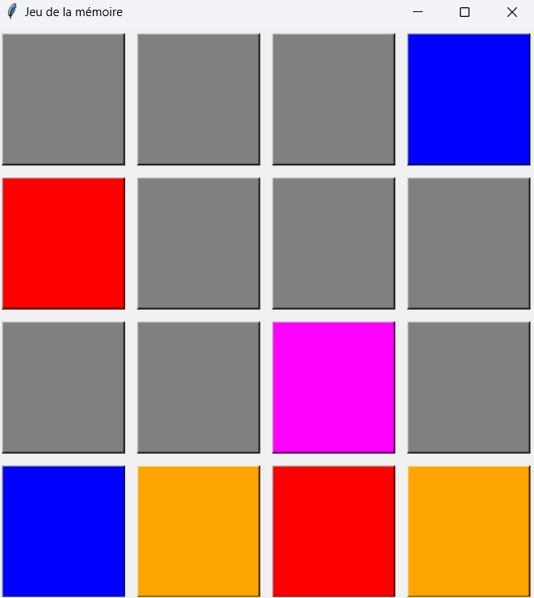

# 🧠 Memory Game -- Python & Tkinter

A small memory game coded in **Python** with **Tkinter**, where the goal
is to match all pairs of colors in as few moves as possible.

------------------------------------------------------------------------

## 🎮 Features

-   Customizable board (size `n x n`)
-   Colors shuffled randomly each game
-   Move counter
-   Victory message with the number of moves taken
-   Simple and responsive graphical interface with Tkinter

------------------------------------------------------------------------

## 📸 Preview



------------------------------------------------------------------------

## 🛠 Dependencies

-   Python 3.x
-   Tkinter (included by default with Python on most systems)

------------------------------------------------------------------------

## 📝 Game Rules

1.  Click on two tiles to flip them.
2.  If the colors match, they stay revealed.
3.  Otherwise, they flip back over.
4.  Find all pairs to win!

------------------------------------------------------------------------

## ⚙️ Installation

### 1. Clone the repository

``` bash
git clone https://github.com/your-username/memory-game.git
cd memory-game
pip install -r requirements.txt
```

### 2. Run the Python script

``` python
python .\main.py
```
